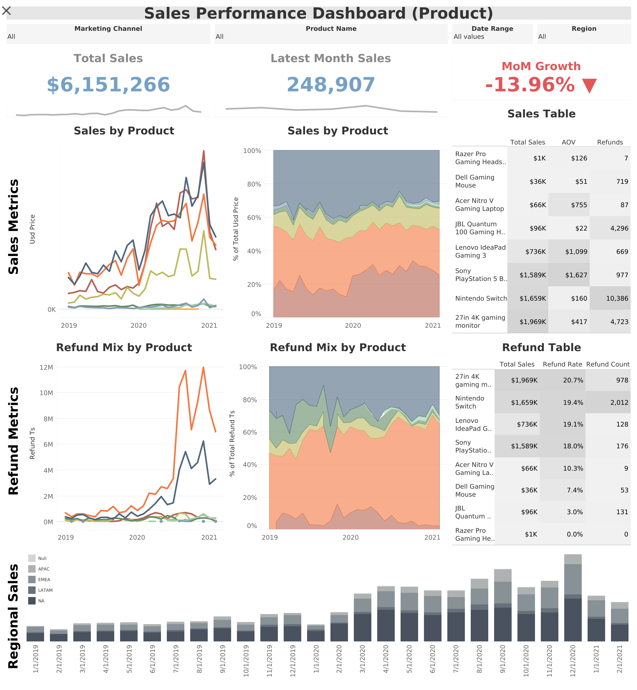
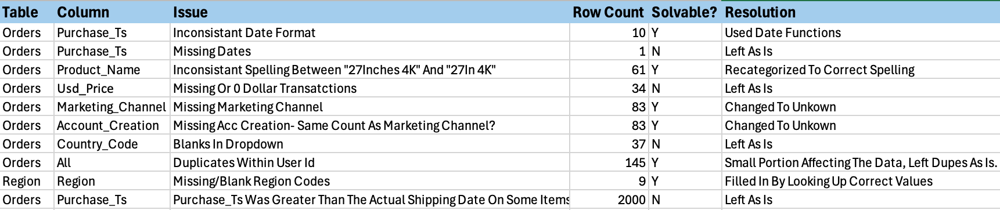
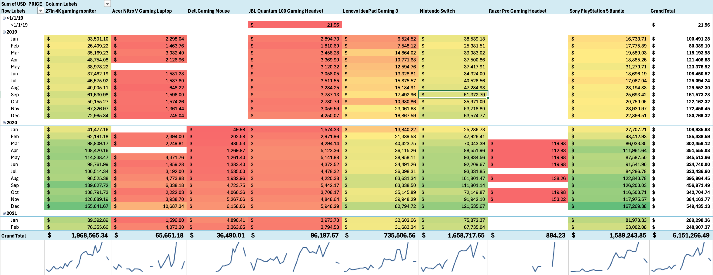
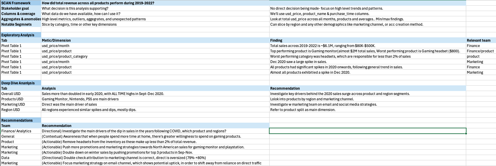

# 📊 Sales Performance Dashboard: Product & Refund Analysis

🔗 **Interactive Dashboard:**  
https://public.tableau.com/views/SalesPerformanceDashboardPublish/Dashboard1

---

## 🎯 Business Objective
Evaluate product-level sales performance from 2019–2022 to identify key revenue drivers, refund patterns, and shifts in growth trends.

The goal of this project was not just to visualize data, but to:
- Identify meaningful trends and anomalies  
- Understand product and channel performance  
- Translate findings into actionable business recommendations  

---

## ❓ Key Business Questions
- Which products are driving the majority of revenue?  
- How has revenue evolved over time?  
- Where are refunds most concentrated?  
- Why is Month-over-Month (MoM) growth declining?  

---

## 🧠 Analytical Approach (SCAN Framework)

To ensure a structured and decision-focused analysis, the SCAN framework was applied:

- **Stakeholder Goal**  
  Understand revenue performance and identify growth drivers and risks  

- **Columns & Coverage**  
  Focused on:
  - `purchase_ts`
  - `usd_price`
  - `product`
  - `marketing_channel`
  - `region`

- **Aggregates & Anomalies**  
  Evaluated:
  - Total revenue trends  
  - Seasonal spikes  
  - Outliers and performance drops  

- **Notable Segments**  
  Segmented analysis by:
  - Product  
  - Region  
  - Marketing channel  

---

## 🧹 Data Cleaning & Quality Checks

Before analysis, several data quality issues were identified and addressed:

- Standardized inconsistent **date formats** for time-series accuracy  
- Consolidated inconsistent **product naming** for proper aggregation  
- Handled missing **marketing channel values** by mapping to `"Unknown"`  
- Reviewed duplicate **user IDs** (minimal analytical impact)  
- Investigated missing **region values** and supplemented where possible  
- Retained **$0 transactions** to preserve real-world behavior (refunds/promotions)  

> ⚠️ Not all issues were removed — some were intentionally preserved to maintain analytical integrity.

---

## 📊 Exploratory Analysis

Initial exploration revealed key performance patterns:

- Total revenue ≈ **$6.15M** across the dataset  
- Revenue increased significantly beginning in **early 2020**  
- Clear **seasonality trends**, with spikes between **September–December**  
- Monthly revenue ranged from ~$80K to ~$500K  
- Strong variation across product categories  

---

## 💡 Key Insights

### 📈 Revenue Trends
- Sales **more than doubled starting in early 2020**
- Peak performance occurred during **Q4 periods (Sep–Dec)**  
- Recent MoM growth shows a **decline of -13.96%**, signaling potential slowdown  

### 🎮 Product Performance
- Revenue is heavily concentrated in:
  - **Nintendo Switch**
  - **PlayStation 5 Bundle**
  - **Gaming Monitor**
- These products act as primary revenue drivers  

### 📉 Underperforming Products
- **Headset category contributes <2% of total revenue**
- Indicates low demand or weak positioning  

### 📬 Marketing Channel Performance
- **Direct traffic dominates conversions**
- Suggests:
  - Strong brand-driven traffic  
  - Or underutilization of marketing channels  

### 🌍 Regional Trends
- Revenue patterns are **consistent across regions**
- Indicates global alignment in demand cycles  

---

## 📌 Recommendations

### 🎯 Product Strategy
- Reevaluate or phase out **low-performing headset products**  
- Prioritize inventory and marketing for top-performing gaming products  

### 📣 Marketing Strategy
- Reduce reliance on **direct traffic (~80%)**  
- Expand investment in:
  - Email marketing  
  - Social media channels  

### 💰 Sales Strategy
- Increase promotions during **peak seasonal periods (Sep–Dec)**  
- Leverage high-performing products for bundled offers  

### 🔍 Further Analysis
- Investigate drivers behind **post-2020 growth slowdown**  
- Analyze performance across:
  - Regions  
  - Marketing channels  
  - Customer segments  

---

## 📈 Dashboard Highlights

The dashboard was designed to prioritize **decision-making clarity over aesthetics**, featuring:

- KPI tracking:
  - Total Sales  
  - Latest Month Sales  
  - MoM Growth  

- Trend analysis:
  - Long-term revenue patterns  
  - Recent performance via sparklines  

- Product-level breakdown:
  - Revenue distribution  
  - Refund concentration  

- Interactive filters:
  - Date range  
  - Region  
  - Marketing channel  

---

## 🛠 Tools Used
- **Tableau Public** → Dashboard development & visualization  
- **Excel** → Data cleaning, validation, and exploratory analysis  

---

## 🚀 Key Takeaway
A strong dashboard is not defined by how it looks — but by what it answers.

This project demonstrates:
- Structured analytical thinking  
- Focus on real business questions  
- Ability to translate data into actionable insights  

> **Insight > Aesthetics**

---

## 👤 Author
**Omar Muniz**  
Aspiring Data Analyst | Business & Supply Chain Analytics Focus
